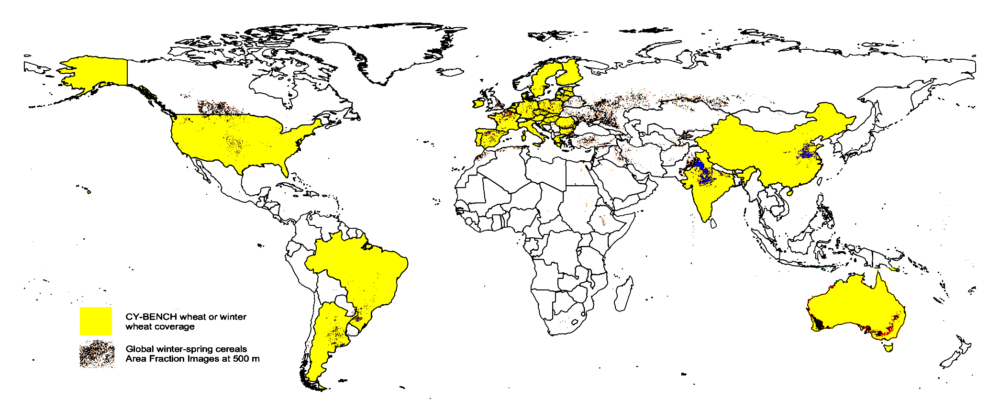

# AgML - Machine Learning for Agricultural Modeling

AgML is the [AgMIP](https://agmip.org/) transdisciplinary community of agricultural and machine learning modelers.

AgML aspires to

* identify key research gaps and opportunities at the intersection of agricultural modelling and machine learning
  research,
* support enhanced collaboration and engagement between experts in these disciplines, and
* conduct and publish protocol-based studies to establish best practices for robust machine learning use in agricultural
  modelling.

## AgML Crop Yield Forecasting

The objective of AgML Crop Yield Forecasting task is to create a benchmark to compare models for crop yield forecasting
across countries and crops. The models and forecasts can be used for food security planning or famine early warning. The
benchmark is called CY-Bench (crop yield benchmark).

### Table of contents

* [Overview](#overview)
* [Getting started](#getting-started)
* [Dataset](#dataset)
* [Leaderboard](#leaderboard)
* [How to cite](#how-to-cite)
* [How to contribute](#how-to-contribute)

### Overview

Early in-season predictions of crop yields can inform decisions at multiple levels of the food value chain from
late-season agricultural management such as fertilization, harvest, and storage to import or export of produce.
Anticipating crop yields is also important to ensure market transparency at the global level (
e.g. [Agriculture Market Information System](https://www.amis-outlook.org/), [GEOGLAM Crop Monitor](https://www.cropmonitor.org/))
and to plan response actions in food insecure countries at risk of food production shortfalls.

We propose CY-Bench, a dataset and benchmark for subnational crop yield forecasting, with coverage of major crop
growing countries and underrepresented countries of the world for maize and wheat. By subnational, we mean the 
administrative level where yield statistics are published. When statistics are available for multiple levels, we
pick the highest resolution. By yield, we mean end-of-season yield statistics as published by national statistics
offices or similar entities representing a group of countries. By forecasting, we mean prediction is made ahead of
harvest. The task is also called in-season crop yield forecasting. In-season forecasting is done at a number of 
time points during the growing season from start of season (SOS) to end of season (EOS) or harvest. The first 
forecast is made at `middle-of-season` (EOS - SOS)/2. Other options are `quarter-of-season` (EOS - SOS)/4
and `n-day(s)` before harvest. The exact time point or time step when forecast is made depends on the crop calendar
for the selected crop and country (or region). All time series inputs are truncated up to the forecast or
inference time point, i.e. data from the remaining part of the season is not used. Since yield statistics may not 
be available for the current season, we evaluate models using predictors and yield statistics for all available
years. The models and forecasts can be used for food security planning or famine early warning. We compare models,
algorithms and architectures by keeping other parts of the workflow as similar as possible. For example: the 
dataset includes same source for each type of predictor (e.g. weather variables, soil moisture, evapotranspiration, 
remote sensing biomass indicators, soil properties), and selected data are preprocessed using the same pipeline 
(use the crop mask, crop calendar; use the same boundary files and approach for spatial aggregation) and (for 
algorithms that require feature design) and same feature design protocol.

#### Coverage for maize

Undifferentiated Maize or Grain Maize where differentiated


#### Coverage for wheat

Undifferentiated Wheat or Winter Wheat where differentiated


#### Deciphering crop names

The terms used to reference different varieties or seasons of maize/wheat has been simplified in CY-Bench. The following
table describes the representative crop name as provided in the crop statistics
| Country/Region | Maize | Wheat |
|--------------------------------------|---------------|------|
| [EU-EUROSTAT](data_preparation/crop_statistics_EU/README.md) | grain maize| soft wheat|
| [Africa-FEWSNET](data_preparation/crop_statistics_FEWSNET/README.md) | maize | -|
| [Argentina](data_preparation/crop_statistics_AR/README.md) | corn | wheat|
| [Australia](data_preparation/crop_statistics_AU/README.md)| -| winter wheat|
| [Brazil](data_preparation/crop_statistics_BR/README.md)| grain corn| grain wheat |
| [China](data_preparation/crop_statistics_CN/README.md)| grain corn| grain wheat/spring wheat/winter wheat|
| [Germany](data_preparation/crop_statistics_DE/README.md) | grain maize| winter wheat|
| [India](data_preparation/crop_statistics_IN/README.md)| maize| wheat|
| [Mali](data_preparation/crop_statistics_ML/README.md)| maize| -|
| [Mexico](data_preparation/crop_statistics_MX/README.md)| white/yellow corn| -|
| [USA](data_preparation/crop_statistics_US/README.md)| grain corn | winter wheat|

### Getting started

`cybench` is an open source python library to load CY-Bench dataset and run the CY-Bench tasks.

#### Installation

```
git clone https://github.com/BigDataWUR/AgML-CY-Bench
```

#### Requirements

The benchmark results were produced in the following test environment:

```
Operating system: Ubuntu 18.04
CPU: Intel Xeon Gold 6448Y (32 Cores)
memory (RAM): 256GB
disk storage: 2TB
GPU: NVIDIA RTX A6000
```

**Benchmark run time**

During the benchmark run with the baseline models, several countries were run in parallel, each in a GPU in a
distributed cluster.
The larger countries took approximately 18 hours to complete.
If run sequentially in a single capable GPU, the whole benchmark should take 50-60 hours to complete.

**Software requirements**: Python 3.9.4, scikit-learn 1.4.2, PyTorch 2.3.0+cu118.

#### Downloading dataset

Get the dataset
from [Google Drive](https://drive.google.com/drive/folders/1lHfCZKiicIDLmYAsmB8Row-zeC-c4yeJ?usp=sharing) or [Zenodo](https://doi.org/10.5281/zenodo.11502143).

#### Running the benchmark

First write a model class `your_model` that extends the `BaseModel` class. The base model class definition is
inside `models.model`.

```
from cybench.models.model import BaseModel
from cybench.runs.run_benchmark import run_benchmark

class MyModel(BaseModel): 
    pass


run_name = <run_name>
dataset_name = "maize_US"
run_benchmark(run_name=run_name, 
              model_name="my_model",
              model_constructor=MyModel,
              model_init_kwargs: <int args>,
              model_fit_kwargs: <fit params>,
              dataset_name=dataset_name)

```

### Dataset

Dataset can be loaded by crop and (optionally by country).

For example

```
dataset = Dataset.load("maize")
```

will load data for countries covered by the maize dataset. Maize data for the US can be loaded as follows:

```
dataset = Dataset.load("maize_US")
```

#### Data sources

| Crop Statistics                                                           | Shapefiles or administrative boundaries                              | Predictors, crop masks, crop calendars                                                     |
|---------------------------------------------------------------------------|----------------------------------------------------------------------|--------------------------------------------------------------------------------------------|
| [Africa from FEWSNET](data_preparation/crop_statistics_FEWSNET/README.md) | [Africa from FEWSNET](data_preparation/shapefiles_FEWSNET/README.md) | Weather: [AgERA5](data_preparation/global_AgERA5/README.md)                                |
| [Mali](data_preparation/crop_statistics_ML/README.md) (1)                 | Use Africa shapefiles from FEWSNET                                   | Soil: [WISE soil data](data_preparation/global_soil_WISE/README.md)                        |
| [Argentina](data_preparation/crop_statistics_AR/README.md)                | [Argentina](data_preparation/shapefiles_AR/README.md)                | Soil moisture: [GLDAS](data_preparation/global_soil_moisture_GLDAS/README.md)              |
| [Australia](data_preparation/crop_statistics_AU/README.md)                | [Australia](data_preparation/shapefiles_AU/README.md)                | Evapotranspiration: [FAO](data_preparation/global_ETO_FAO/README.md)                       |
| [Brazil](data_preparation/crop_statistics_BR/README.md)                   | [Brazil](data_preparation/shapefiles_BR/README.md)                   | FAPAR: [JRC FAPAR](data_preparation/global_fpar_500m/README.md)                            |
| [China](data_preparation/crop_statistics_CN/README.md)                    | [China](data_preparation/shapefiles_CN/README.md)                    | Crop calendars: [ESA WorldCereal](data_preparation/global_crop_calendars_ESA_WC/README.md) |
| [EU](data_preparation/crop_statistics_EU/README.md)                       | [EU](data_preparation/shapefiles_EU/README.md)                       | NDVI: [MOD09CMG](data_preparation/global_ndvi_MOD09CMG/README.md)                               |
| [Germany](data_preparation/crop_statistics_DE/README.md) (2)              | Use EU shapefiles                                                    | Crop Masks: [ESA WorldCereal](data_preparation/global_crop_AFIs_ESA_WC/README.md)          |
| [India](data_preparation/crop_statistics_IN/README.md)                    | [India](data_preparation/shapefiles_IN/README.md)                    |                                                                                            |
| [Mexico](data_preparation/crop_statistics_MX/README.md)                   | [Mexico](data_preparation/shapefiles_MX/README.md)                   |                                                                                            |
| [US](data_preparation/crop_statistics_US/README.md)                       | [US](data_preparation/shapefiles_US/README.md)                       |                                                                                            |

1: Mali data at admin level 3. Mali data is also included in the FEWSNET Africa dataset, but at admin level 1 only.

2: Germany data is also included in the EU dataset, but there most of the data fails coherence tests (e.g. yield =
production / harvest_area)

### Leaderboard

#### Maize

| Country | Lead time | Naive (1) NRMSE | Trend (2) NRMSE | Ridge (3) NRMSE | RF (4) NRMSE | LSTM (5) NRMSE | Naice MAPE | Trend MAPE | Ridge MAPE | RF MAPE | LSTM MAPE |
|----|-------------------|--------|--------|--------|--------|--------|---------|---------|---------|---------|---------|
| AO | middle-of-season  | 41.365 | 37.143 | 47.915 | 44.090 | 45.619 | 144.500 | 141.337 | 178.321 | 189.434 | 281.368 |
| AO | quarter-of-season | 41.365 | 37.143 | 63.806 | 43.094 | 43.805 | 144.500 | 141.337 | 151.382 | 187.496 | 248.149 |
| ES | middle-of-season  | 15.996 | 12.021 | 27.674 | 20.263 | 27.692 | 15.058  | 11.374  | 34.200  | 19.968  | 32.791 |
| ES | quarter-of-season | 15.996 | 12.021 | 24.505 | 18.779 | 23.021 | 15.058  | 11.374  | 28.716  | 18.862  | 26.063 |
| NL | middle-of-season  | 15.315 | 15.510 | 18.116 | 16.361 | 50.878 | 13.888  | 14.045  | 16.023  | 14.865  | 47.849 |
| NL | quarter-of-season | 15.315 | 15.510 | 16.112 | 15.640 | 49.786 | 13.888  | 14.045  | 14.619  | 14.407  | 46.681 |

#### Wheat

| Country | Lead time  | Naive NRMSE | Trend NRMSE | Ridge NRMSE | RF NRMSE | LSTM NRMSE | Naice MAPE | Trend MAPE | Ridge MAPE | RF MAPE | LSTM MAPE |
|----|-------------------|--------|--------|--------|--------|-|--------|---------|---------|----------|--|
| NL | middle-of-season  | 7.556 | 7.796 | 56.841 | 8.529 | 18.261 | 6.686  | 6.935  | 56.102  | 7.591  | 16.190 |
| NL | quarter-of-season | 7.556 | 7.796 | 66.091 | 8.705 | 18.916 | 6.686  | 6.935  | 65.531  | 7.813  | 16.670 |

NOTES:
1. Naive: Predicts average yield per admin region from the training set. If admin region is not present in the training set, it predicts the global average.
2. Trend: Linear Trend model fits a line through the training labels. The test year can be in the middle of training years or on either side of them.
3. Ridge: Ridge estimator from scikit-learn with feature selection (keeping 20, 25 or 30 features using Lasso as a selector) and optimization of `alpha` (or weight decay) hyperparameter.
4. RF: RandomForestRegressor from scikit-learn without feature selection but optimization of one hyperparameter (`n_estimators` selected from 50, 100, 500).
5. LSTM: One LSTM layer for time series inputs followed by concatenation with static inputs fed to a linear prediction layer. Number of epochs trained is 50.

### How to cite

Please cite CY-bench as follows:

<pre>
@dataset{paudel_etal2024,
  author       = {Paudel, Dilli and
                  Baja, Hilmy and
                  van Bree, Ron and
                  Kallenberg, Michiel and
                  Ofori-Ampofo, Stella and
                  Potze, Aike and
                  Poudel, Pratishtha and
                  Saleh, Abdelrahman and
                  Anderson, Weston and
                  von Bloh, Malte and
                  Castellano, Andres and
                  Ennaji, Oumnia and
                  Hamed, Raed and
                  Laudien, Rahel and
                  Lee, Donghoon and
                  Luna, Inti and
                  Masiliūnas, Dainius and
                  Meroni, Michele and
                  Mutuku, Janet Mumo and
                  Mkuhlani, Siyabusa and
                  Richetti, Jonathan and
                  Ruane, Alex C. and
                  Sahajpal, Ritvik and
                  Shuai, Guanyuan and
                  Sitokonstantinou, Vasileios and
                  de Souza Noia Junior, Rogerio and
                  Srivastava, Amit Kumar and
                  Strong, Robert and
                  Sweet, Lily-belle and
                  Vojnović, Petar and
                  de Wit, Allard and
                  Zachow, Maximilian and
                  Athanasiadis, Ioannis N.},
  title        = {{CY-Bench: A comprehensive benchmark dataset
                   for subnational crop yield forecasting}},
  year         = 2024,
  publisher    = {AgML (https://www.agml.org/)},
  version      = {1.0},
  doi          = {10.5281/zenodo.11502143},
}
</pre>

### How to contribute

Thank you for your interest in contributing to AgML Crop Yield Forecasting. Please
check [contributing guidelines](CONTRIBUTING.md) for how to get involved and contribute.

## Additional information

For more information please visit [the AgML website](https://www.agml.org/).
