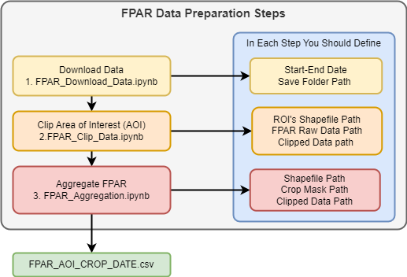

# Global FPAR 500 m
The European Commission's Joint Research Centre (JRC) prepared the spatially and temporally consistent 500 m FPAR time series using the well-established Whittaker smoothing procedure developed by BOKU University. Historical records based on MODIS since 21 May 2000. Near real-time production with two days latency, currently (as of 20/11/2023) still based on MODIS Terra and Aqua, ready to switch to bias corrected VIIRS instruments onboard the SUOMI-NPP and NOAA-20 satellites.

## BACKGROUND INFORMATION
The MODIS data (MOD15A2H and MOD15A3H) are subject to different atmospheric conditions and viewing geometries that interfere with the quality of the derived FPAR data and/or lead to data gaps. As the interfering elements have strong temporal and spatial dependencies, the deterioration of the raw FPAR is unequal over space and time, introducing strong artifacts when analyzing data over extended scales. These effects are diminished to a certain extent as the above MODIS products involve a maximum value compositing (MVC) for 8- and 4-days, respectively. Effects are, however, not completely removed through MVC. An appropriate filtering and interpolation procedure significantly improves the raw data quality and data usability and makes it suitable for operational near real-time (NRT) activities and yield forecasting.

JRC curated time series, thanks to its constrained filtering, particularly suited for NRT analyses, as pixel- and site-specific intelligence is used to inform the filter about the expected temporal course of the time series. This processing chain has been already used within the JRC early warning system Anomaly Hotspots of Agricultural Production (ASAP, https://mars.jrc.ec.europa.eu/asap/) but for different input data (MOD13A2 and MYD13A2 products). The ASAP system itself is currently transitioning to the new FPAR product.

## DATASET LINK
The data is publicly available on the following url:
https://agricultural-production-hotspots.ec.europa.eu/data/indicators_fpar/

It is shared using the WebDAV protocol (https://en.wikipedia.org/wiki/WebDAV).

FPAR is available from 2000-05-21 up to 2023-07-21.

FPAR is expressed in % (0-100).

valid_range=0-100

flags=251-other land, 254-water, 255-not processed

Note: in Q2 of 2024 FPAR will be directly available in the ASAP system and we will transition to a different sharing service for NRT data also providing a web service that can be used to get information about the indicators availability.

## PUBLISHER
Food Security Unit of the European Commission’s Joint Research Center (JRC D.5).

## CONTACT NAME
Michele Meroni

## DATASET OVERVIEW
**Coordinate system**: WGS_1984

**Spatial resolution - Pixel Size**: 0.004464 deg (about 500 m)

**Temporal resolution**: dekadal (every 10 days; 3 deakds in a month, 1-10, 11-20, 21-end of the month, 36 dekads in a year)

**FPAR values**: 0 to 100 (%)

**Consolidation stages in NRT production**: 5 stages (C0 to C4)*

**Fully consolidated stage**: CF, produced 9 dekads after NRT production*

* Filtering refers to NRT production while off-line smoothing refers to historical data production. Filtering is relevant in an online learning sense, in which current conditions are to be estimated by the currently available data. To filter data with high accuracy suitable to NRT analyses, we make use not only of the currently available FPAR and corresponding quality data, but also of ‘intelligence’ derived from the off-line smoothed data (e.g. plausible pathways of a given pixel, considering its past evolution, the filtering conditions, and the specific season/location of that pixel).

The filtering is executed at the end of each 10-day period (dekad) estimating the state of vegetation (FPAR) based on the data that were or are available at that time including the past 190 days (temporally overlapping windows). The length of the temporal window (TWL) is indicated in the following Figure as a dark blue arrow.

The filtering itself follows the same procedure as described for the off-line smoothing (e.g. blue line). However, the output is different. At each filtering step (e.g. for each 10-day period), the NRT filtering outputs and stores six images indicated as black dots in the Figure. We do not only store filtered FPAR images of the successive dekad (last black dot; consolidation stage 0 (C0)) but also for the past four dekads, representing different consolidation stages of the filtered FPAR (C1 to C4). Obviously, C4 (consolidation stage 4) is more reliable (e.g. better constrained through available data – and less “extrapolated”) compared to C0 which is always extrapolated as (reliable) MODIS observations become available only after some days.
The sixth and final image stored every dekad corresponds to the black dot in the center of the temporal window (fully consolidated CF) in the Figure 6-4. For the given example, obviously, this fully smoothed value will become available only after 9 dekads but has the advantage of using observations available to the left and right (e.g. back and forward in time). Hence, this output is of highest quality.

## PROVENANCE
**Method details**: The details of this procedure are documented in the MARSOP 6 - Framework Contract N 943209 – IPR – 2022) technical report “Description of the Whittaker Implementation Deliverable MODIS S8.1”. Methods and quality assessment are reported in Klisch and Atzberger (2016) and Meroni et al. (2019).

## Data Preparation For Machine Learning
the streamlined workflow for preparing FPAR data using a series of Jupyter notebooks. The workflow is divided into three primary steps: downloading, clipping, and aggregating the FPAR data. Each notebook is designed to guide you through a specific part of the data preparation process:

1_FPAR_Download_Data.ipynb - Automates the download of high-resolution FPAR data for a user-defined period and saves it to a specified folder.
2_FPAR_Clip_Data.ipynb - Clips the FPAR data to your specified Area of Interest (AOI) using shapefiles, reducing the dataset size and focusing on the region relevant to your study.
3_FPAR_Aggregation.ipynb - Aggregates the clipped FPAR data into a CSV file.

Notebooks prepared by Abdelrahman Amr Ali

## REFERENCES: 
Klisch, A.; Atzberger, C.: Operational drought monitoring in Kenya using MODIS NDVI time series. Remote Sens., 2016, 8, 267.

Meroni, M., Fasbender, D., Rembold, F., Atzberger, C., Klisch, A.: Near real-time vegetation anomaly detection with MODIS NDVI: Timeliness vs. accuracy and effect of anomaly computation options. Remote Sens. Environ., 2019, 221, 508–521. https://doi.org/10.1016/j.rse.2018.11.041